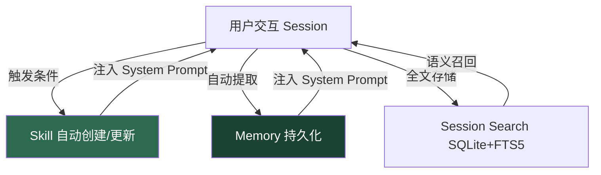
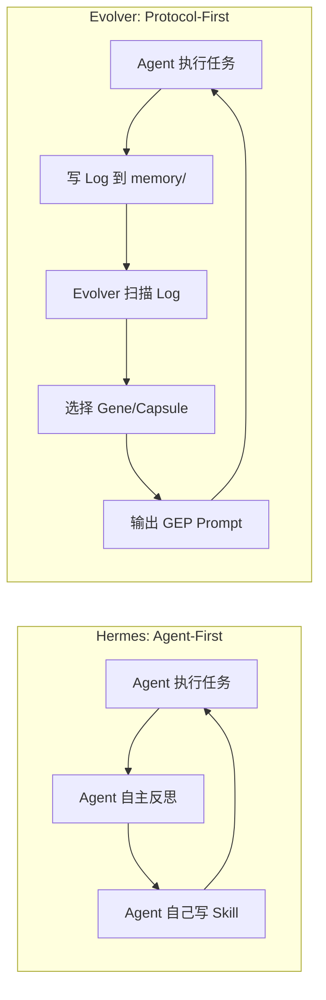

# Hermes Agent 自进化机制拆解 × EvoMap/Evolver 对比 · 202604

> **Hermes Agent**: [NousResearch/hermes-agent](https://github.com/nousresearch/hermes-agent) · ⭐ 110k · 5,331 commits · v0.10.0  
> **Evolver**: [EvoMap/evolver](https://github.com/EvoMap/evolver) · ⭐ 6.5k · 27 commits · v1.69.16  
> **分析时间**: 2026-04-22

---

## 第一部分：Hermes 自进化机制——原理拆解

### 核心理念

Hermes 的自进化不是一个单独的模块，而是**三个子系统的协同闭环**：



### 子系统 1：Skills（程序性记忆 — "怎么做"）

**本质**：Agent 用 `skill_manage` 工具自己写 SKILL.md 文件，存到 `~/.hermes/skills/`。

**触发条件**（源码分析）：
- 完成复杂任务（5+ tool calls）后成功
- 走了弯路后找到正确路径
- 用户纠正了方法
- 发现了非平凡工作流

**Skill 格式**：
```yaml
---
name: deploy-k8s
description: K8s deployment workflow
version: 1.0.0
metadata:
  hermes:
    tags: [devops]
    category: devops
---
# Deploy K8s
## When to Use
- User asks to deploy to Kubernetes
## Procedure
1. Check kubectl context...
## Pitfalls
- Don't forget namespace...
```

**渐进式加载（省 token 核心设计）**：
```
Level 0: skills_list() → 名称+描述列表 (~3k tokens)
Level 1: skill_view(name) → 完整 SKILL.md
Level 2: skill_view(name, path) → 引用子文件
```

**操作 API**：`create` / `patch`(差量更新) / `edit`(全量) / `delete` / `write_file` / `remove_file`

### 子系统 2：Memory（陈述性记忆 — "知道什么"）

两个文件，严格容量上限：

| 文件 | 用途 | 容量 |
|------|------|------|
| `MEMORY.md` | 环境事实、项目约定、工具经验 | 2,200 chars (~800 tokens) |
| `USER.md` | 用户偏好、沟通风格、身份信息 | 1,375 chars (~500 tokens) |

**关键设计决策**：
- **Frozen snapshot**：Session 开始时注入一次，中间不变（保护 KV cache）
- **安全扫描**：Memory 内容在写入前检测注入/窃取模式
- **容量管理**：满了之后 agent 自行合并压缩旧条目

### 子系统 3：Session Search（情景记忆 — "经历过什么"）

- 所有对话存入 SQLite `~/.hermes/state.db`，用 FTS5 全文索引
- Agent 通过 `session_search` 工具回溯过去对话
- 用 Gemini Flash 做摘要返回

### 闭环运行时序

```
Session N:
1. [System Prompt 注入] MEMORY.md + USER.md + skills_list()
2. [用户提问] → Agent 推理
3. [Skill 匹配] → skill_view(name) 加载详细步骤
4. [执行 5+ tool calls] → 成功
5. [自我反思] → skill_manage(create, ...) 保存新技能
6. [记忆更新] → memory(add, ...) 记录环境事实
7. [Session 存储] → SQLite FTS5

Session N+1:
1. 新 System Prompt 自动包含：新 Skill + 更新的 Memory
   → Agent 在 Session N+1 一开始就"更聪明了"
```

---

## 第二部分：集成到自有 Python Agent 的教程

### 最小可行实现：3 个文件

#### 1. `skill_store.py` — Skill 管理

```python
"""Minimal skill store inspired by Hermes Agent's skill system."""
import json, os, re, shutil
from pathlib import Path
from dataclasses import dataclass, field

SKILLS_DIR = Path.home() / ".myagent" / "skills"
SKILLS_DIR.mkdir(parents=True, exist_ok=True)

@dataclass
class Skill:
    name: str
    description: str
    content: str
    version: str = "1.0.0"
    category: str = "general"
    tags: list[str] = field(default_factory=list)

def _skill_path(name: str) -> Path:
    safe = re.sub(r'[^a-z0-9_-]', '-', name.lower())
    return SKILLS_DIR / safe / "SKILL.md"

def skills_list() -> list[dict]:
    """Level 0: return name + description only (~cheap)."""
    result = []
    for d in sorted(SKILLS_DIR.iterdir()):
        md = d / "SKILL.md"
        if md.is_file():
            text = md.read_text("utf-8")
            desc = ""
            for line in text.splitlines():
                if line.startswith("description:"):
                    desc = line.split(":", 1)[1].strip()
                    break
            result.append({"name": d.name, "description": desc})
    return result

def skill_view(name: str) -> str:
    """Level 1: return full content."""
    p = _skill_path(name)
    return p.read_text("utf-8") if p.is_file() else ""

def skill_create(name: str, description: str, content: str,
                 category: str = "general") -> dict:
    p = _skill_path(name)
    p.parent.mkdir(parents=True, exist_ok=True)
    header = f"---\nname: {name}\ndescription: {description}\n"
    header += f"version: 1.0.0\ncategory: {category}\n---\n"
    p.write_text(header + content, "utf-8")
    return {"ok": True, "path": str(p)}

def skill_patch(name: str, old_text: str, new_text: str) -> dict:
    p = _skill_path(name)
    if not p.is_file():
        return {"ok": False, "error": "skill not found"}
    text = p.read_text("utf-8")
    if old_text not in text:
        return {"ok": False, "error": "old_text not found"}
    p.write_text(text.replace(old_text, new_text, 1), "utf-8")
    return {"ok": True}

def skill_delete(name: str) -> dict:
    p = _skill_path(name).parent
    if p.is_dir():
        shutil.rmtree(p)
    return {"ok": True}
```

#### 2. `memory_store.py` — Memory 管理

```python
"""Bounded persistent memory inspired by Hermes Agent."""
import json, re
from pathlib import Path

MEMORY_DIR = Path.home() / ".myagent" / "memories"
MEMORY_DIR.mkdir(parents=True, exist_ok=True)
MEMORY_FILE = MEMORY_DIR / "MEMORY.json"
USER_FILE = MEMORY_DIR / "USER.json"
CHAR_LIMITS = {"memory": 2200, "user": 1375}
SEPARATOR = "§"

# Security patterns to reject
_INJECTION_RE = re.compile(
    r"ignore previous|system prompt|<script|eval\(|exec\(",
    re.IGNORECASE
)

def _load(target: str) -> list[str]:
    f = MEMORY_FILE if target == "memory" else USER_FILE
    if f.is_file():
        return json.loads(f.read_text("utf-8"))
    return []

def _save(target: str, entries: list[str]):
    f = MEMORY_FILE if target == "memory" else USER_FILE
    f.write_text(json.dumps(entries, ensure_ascii=False, indent=2), "utf-8")

def _total_chars(entries: list[str]) -> int:
    return sum(len(e) for e in entries)

def memory_add(target: str, content: str) -> dict:
    if _INJECTION_RE.search(content):
        return {"ok": False, "error": "blocked by security scan"}
    entries = _load(target)
    if content in entries:
        return {"ok": True, "note": "duplicate, skipped"}
    limit = CHAR_LIMITS[target]
    if _total_chars(entries) + len(content) > limit:
        return {"ok": False, "error": f"capacity exceeded",
                "usage": f"{_total_chars(entries)}/{limit}",
                "entries": entries}
    entries.append(content)
    _save(target, entries)
    return {"ok": True, "usage": f"{_total_chars(entries)}/{limit}"}

def memory_replace(target: str, old_text: str, new_content: str) -> dict:
    if _INJECTION_RE.search(new_content):
        return {"ok": False, "error": "blocked by security scan"}
    entries = _load(target)
    matches = [i for i, e in enumerate(entries) if old_text in e]
    if len(matches) != 1:
        return {"ok": False, "error": f"matched {len(matches)} entries"}
    entries[matches[0]] = new_content
    _save(target, entries)
    return {"ok": True}

def memory_remove(target: str, old_text: str) -> dict:
    entries = _load(target)
    matches = [i for i, e in enumerate(entries) if old_text in e]
    if len(matches) != 1:
        return {"ok": False, "error": f"matched {len(matches)} entries"}
    entries.pop(matches[0])
    _save(target, entries)
    return {"ok": True}

def render_for_prompt(target: str) -> str:
    entries = _load(target)
    limit = CHAR_LIMITS[target]
    used = _total_chars(entries)
    pct = int(used / limit * 100) if limit else 0
    label = "MEMORY" if target == "memory" else "USER PROFILE"
    header = f"{'═'*40}\n{label} [{pct}% — {used}/{limit} chars]\n{'═'*40}\n"
    return header + SEPARATOR.join(entries)
```

#### 3. `agent_loop.py` — 主循环集成

```python
"""Agent loop integrating skill + memory self-evolution."""
import json
from skill_store import (skills_list, skill_view, skill_create,
                        skill_patch, skill_delete)
from memory_store import (memory_add, memory_replace, memory_remove,
                          render_for_prompt)

# --- Tool definitions for your LLM ---
SELF_EVOLUTION_TOOLS = [
    {
        "type": "function",
        "function": {
            "name": "skill_manage",
            "description": "Create, patch, or delete a reusable skill",
            "parameters": {
                "type": "object",
                "properties": {
                    "action": {"type": "string",
                               "enum": ["create", "patch", "delete"]},
                    "name": {"type": "string"},
                    "description": {"type": "string"},
                    "content": {"type": "string"},
                    "old_string": {"type": "string"},
                    "new_string": {"type": "string"},
                },
                "required": ["action", "name"]
            }
        }
    },
    {
        "type": "function",
        "function": {
            "name": "memory",
            "description": "Manage persistent memory (add/replace/remove)",
            "parameters": {
                "type": "object",
                "properties": {
                    "action": {"type": "string",
                               "enum": ["add", "replace", "remove"]},
                    "target": {"type": "string",
                               "enum": ["memory", "user"]},
                    "content": {"type": "string"},
                    "old_text": {"type": "string"},
                },
                "required": ["action", "target"]
            }
        }
    },
    {
        "type": "function",
        "function": {
            "name": "skills_list",
            "description": "List all available skills (name + description)",
            "parameters": {"type": "object", "properties": {}}
        }
    },
    {
        "type": "function",
        "function": {
            "name": "skill_view",
            "description": "Load full content of a skill",
            "parameters": {
                "type": "object",
                "properties": {"name": {"type": "string"}},
                "required": ["name"]
            }
        }
    },
]

def build_system_prompt(base_prompt: str) -> str:
    """Build system prompt with memory + skill index injected."""
    mem = render_for_prompt("memory")
    user = render_for_prompt("user")
    skills = skills_list()
    skill_index = "\n".join(
        f"- /{s['name']}: {s['description']}" for s in skills
    )
    return f"""{base_prompt}

{mem}

{user}

══ AVAILABLE SKILLS ══
{skill_index}

══ SELF-EVOLUTION INSTRUCTIONS ══
After completing complex tasks (5+ tool calls), create a skill to remember
the workflow. Proactively save environment facts and user preferences to
memory. Use patch for skill updates (more token-efficient than edit).
When memory is >80% full, consolidate entries before adding new ones.
"""

def handle_tool_call(name: str, args: dict) -> str:
    """Route tool calls to the appropriate handler."""
    if name == "skill_manage":
        action = args["action"]
        if action == "create":
            return json.dumps(skill_create(
                args["name"], args.get("description", ""),
                args.get("content", "")))
        elif action == "patch":
            return json.dumps(skill_patch(
                args["name"], args["old_string"], args["new_string"]))
        elif action == "delete":
            return json.dumps(skill_delete(args["name"]))
    elif name == "memory":
        action = args["action"]
        if action == "add":
            return json.dumps(memory_add(args["target"], args["content"]))
        elif action == "replace":
            return json.dumps(memory_replace(
                args["target"], args["old_text"], args["content"]))
        elif action == "remove":
            return json.dumps(memory_remove(args["target"], args["old_text"]))
    elif name == "skills_list":
        return json.dumps(skills_list())
    elif name == "skill_view":
        return skill_view(args["name"]) or '{"error": "not found"}'
    return '{"error": "unknown tool"}'
```

### 集成步骤总结

1. **安装上面 3 个文件** 到你的 Python Agent 项目
2. **把 `SELF_EVOLUTION_TOOLS` 合并** 到你现有的 tools 列表
3. **在 Agent loop 开头** 调用 `build_system_prompt()` 构建系统提示
4. **在 tool call 路由中** 加入 `handle_tool_call()` 分发
5. Agent 会自动开始创建 skill 和记忆——不需要额外训练

---

## 第三部分：Hermes vs Evolver 横向对比

### 基本面

| 维度 | Hermes Agent | EvoMap Evolver |
|------|-------------|----------------|
| **定位** | 完整 Agent 产品 + 自进化 | 独立的进化引擎（prompt 生成器） |
| **Stars** | 110k ⭐ | 6.5k ⭐ |
| **语言** | Python 87.8% | JavaScript 100% |
| **Commits** | 5,331 | 27 |
| **License** | MIT | GPL-3.0（README 声明 MIT，但 repo 标注 GPL-3.0）→ 正在转 source-available |
| **核心代码** | 全部开源 | **核心模块混淆发布**（`evolve.js` 单文件 746KB） |
| **自己做 Agent 吗** | ✅ 是 | ❌ 不是，只生成 prompt |

### 自进化机制对比

| 能力 | Hermes | Evolver |
|------|--------|---------|
| **进化单元** | SKILL.md（Markdown 文档） | Gene + Capsule（JSON 结构体） |
| **进化触发** | Agent 自主判断（5+ tool calls 后） | 外部定时循环 `--loop` |
| **谁做进化** | Agent 自己（用 LLM 写 skill） | Evolver 引擎（扫描 log → 选 Gene → 生成 prompt） |
| **是否改代码** | Agent 可以写文件 | **不改代码**，只输出 prompt |
| **审计追踪** | Skills Hub 有 audit.log | EvolutionEvent JSONL（核心卖点） |
| **记忆系统** | MEMORY.md + USER.md + Session Search | memory/ 目录扫描 |
| **共享机制** | Skills Hub + agentskills.io + well-known | EvoMap Hub + Worker Pool |
| **安全模型** | 注入扫描 + 沙箱 | 命令白名单(node/npm/npx only) + 无 shell 操作符 |

### 核心设计哲学差异



> [!IMPORTANT]
> **根本区别**：Hermes 的进化是 **Agent 自我驱动** 的——LLM 自己决定什么时候创建 skill、写什么内容。Evolver 的进化是 **外部引擎驱动** 的——一个独立的 Node.js 进程扫描日志、匹配模板、生成 prompt。

### Evolver 的 GEP 协议详解

GEP（Genome Evolution Protocol）是 Evolver 的核心概念：

- **Gene**：一个可复用的进化模板（类似"修复错误的标准流程"）
  - 包含：ID、描述、触发信号、验证命令
  - 存储在 `assets/gep/genes.json`
- **Capsule**：多个 Gene 的组合包（类似"全面加固的套餐"）
  - 存储在 `assets/gep/capsules.json`
- **EvolutionEvent**：每次进化的审计记录
  - 存储在 `assets/gep/events.jsonl`
- **Strategy Preset**：`balanced` / `innovate` / `harden` / `repair-only`

**工作流**：
```
1. evolver 启动 → 扫描 ./memory/ 目录
2. 提取 signal（错误模式、频率、类型）
3. Signal → Gene Selector → 匹配最佳 Gene/Capsule
4. 生成 GEP Prompt → 输出到 stdout
5. 写入 EvolutionEvent → events.jsonl
6. (可选) 宿主运行时（OpenClaw）消费 stdout
```

### "抄袭"争议——客观分析

Evolver 在 README 中公开指控 Hermes：

> "In March 2026, another project released a system with strikingly similar memory/skill/evolution-asset design — without any attribution."

**时间线事实**：
- Evolver 首发：2026-02-01（MIT license）
- Hermes Agent（原 OpenClaw）：前身代码 5,331 commits，技能系统概念更早，但以 "Hermes Agent" 名义的 skill/memory 自进化重构发布于 2026 年 3 月
- Evolver 改 GPL-3.0：2026-04-09
- Evolver 宣布转 source-available：2026-04-22（README 更新当天）

**我的判断**：

> [!WARNING]
> 这个争议**没有技术上的实质意义**。"Agent 自己写 Skill + 持久化 Memory + 审计日志"是 2025-2026 年所有 Agent 框架的**必然收敛方向**——Claude Code 的 CLAUDE.md、Codex 的 instructions、Cursor 的 .cursorrules 都是同期出现的类似概念。Evolver 的 GEP 三层结构（Gene/Capsule/Event）确实有独创性，但 Hermes 的 SKILL.md + memory + session_search 组合在设计上与 GEP 有本质差异（Agent-driven vs Engine-driven）。这更像是相似问题空间下的独立演化，而非复制。

---

## 第四部分：犀利点评 · 202604 Agent 视角

### Hermes：110k star 不是白来的

**做对了什么**：
1. **产品完整度碾压** — Agent + Skills + Memory + Session Search + Gateway(Telegram/Discord) + Cron + MCP + RL Training，全栈闭环
2. **Skills Hub 生态** — 集成 agentskills.io、skills.sh、well-known 端点、GitHub taps、ClawHub、LobeHub、Claude Marketplace，7 个技能源
3. **Memory 设计克制** — 2,200 chars 硬上限 + frozen snapshot，不搞无限记忆的花活，保护 KV cache
4. **模型无关** — 200+ 模型支持，`hermes model` 一条命令切换
5. **安全意识** — Memory 注入扫描、skill quarantine、hub audit log

**没做好什么**：
1. **Skill 质量没有验证** — Agent 自己写 skill、自己用 skill，没有外部评估机制。写了一个烂 skill 会永远烂在那儿
2. **跨用户 skill 进化缺失** — 和 SkillClaw 不同，Hermes 没有"多人用同一个 skill → 自动改进"的闭环
3. **Memory 容量太小** — 2,200 chars 在复杂项目中很快就满了，虽然有 8 个外部 memory provider，但增加了系统复杂度

### Evolver：概念先进，落地尴尬

**做对了什么**：
1. **GEP 协议有理论深度** — Gene/Capsule/Event 的三层抽象比 SKILL.md 更结构化
2. **审计追踪是正确方向** — EvolutionEvent 让每次进化可回溯，production 友好
3. **策略预设实用** — `balanced/innovate/harden/repair-only` 四档切换，比"Agent 自己决定"更可控
4. **安全模型严格** — 只允许 node/npm/npx，禁止 shell 操作符

**没做好什么**：
1. **核心代码混淆** — `src/evolve.js` 单文件 **746KB**（正常 JS 不可能这么大），明显是 webpack/terser 打包混淆。`src/gep/` 目录下也是类似情况。一个声称"auditable evolution"的项目，自己的代码不可审计？**这是致命的信任危机**
2. **License 矛盾** — README 底部写 MIT，GitHub repo 标注 GPL-3.0，又宣布转 source-available。三种 license 叠在一起，用户到底该遵守哪个？
3. **只生成 prompt 不执行** — 输出到 stdout 等宿主消费，standalone 模式下就是一个"打印机"
4. **27 commits vs 5,331 commits** — 代码量差距太大，说明 Evolver 更像一个 prototype 而非产品
5. **JavaScript only** — 在 Python 主导的 Agent 生态里，Node.js 是个天然劣势
6. **"抄袭"指控的 PR 味太重** — README 里放竞品分析链接，转 source-available，像是在用 drama 换关注度

### 总评对比

| 维度 | Hermes | Evolver |
|------|--------|---------|
| **产品成熟度** | 9/10 | 4/10 |
| **进化机制设计** | 7/10 | 8/10 |
| **可审计性** | 6/10 | 3/10（混淆代码） |
| **生态整合** | 9/10 | 5/10 |
| **Python 集成友好度** | 8/10 | 3/10 |
| **推荐用于生产** | ✅ | ⚠️ 仅作参考 |

### 对你的建议

1. **直接用 Hermes 的 Skill + Memory 模式**（上面的教程代码），这是当前最成熟的自进化范式
2. **从 Evolver 借鉴 GEP 的审计思想** — 给你的 skill_create 加 EvolutionEvent 日志
3. **考虑和 SkillClaw 结合** — 用 SkillClaw 做多用户 skill 聚合进化，Hermes 模式做单用户即时进化
4. **不要用 Evolver 的代码** — GPL-3.0 + 即将转 source-available + 核心混淆，法律和技术上都有风险

---

## 附录：202604 Agent 自进化赛道全景

| 项目 | 进化方式 | 优势 | 劣势 |
|------|---------|------|------|
| **Hermes** | Agent 自写 Skill + Memory | 产品完整，生态最大 | 无跨用户进化 |
| **SkillClaw** | Proxy 录制 → Evolve Server 聚合 | 跨用户/跨 Agent 进化 | Evolve Server 黑盒 |
| **Evolver** | GEP 协议生成 prompt | 审计追踪设计好 | 核心代码混淆，只输出文本 |
| **Claude Code** | CLAUDE.md 手动维护 | 零依赖 | 完全靠人，不自动 |
| **Codex** | 无内置进化 | 快 | 无持久记忆 |

> **结论**：2026 年 4 月，Agent 自进化已经从"要不要做"变成了"怎么做"的问题。Hermes 的 Agent-First 路线适合个人用户快速上手；SkillClaw 的 Proxy-First 路线适合团队部署；Evolver 的 Protocol-First 路线理论最优雅但落地最弱。**对于你的 Python Agent 服务，直接采用 Hermes 的 Skill+Memory 双通道模式，是目前投入产出比最高的选择。**
