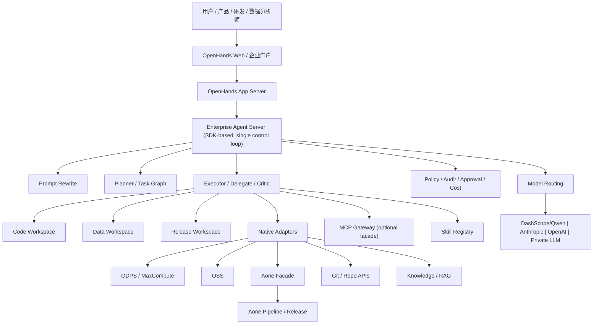

# 基于 OpenHands 的企业级 Agent 平台最优构建方案（复审修订版）

更新时间：2026-04-27  
分析基线：

- `OpenHands/OpenHands`：`main`@`b41dd2ba8b1a0111381dc3a484f6487363b474da`
- `OpenHands/software-agent-sdk`：`main`@`7948984b9fc910e4f985a45b16eff24075541165`
- 参考内部旧稿：《Agent 开发平台深度调研报告（2026-04）》

本版复审重点修正了 5 个问题：

1. 明确 `OpenHands App Server`、`Enterprise Agent Server`、`Workspace/Sandbox` 的单一职责，避免“双大脑”
2. 明确 `TaskToolSet` 与 `DelegateTool` 的边界，避免把顺序任务流和并行子代理混为一谈
3. 调整“万物 MCP 化”的倾向，改为“核心内部系统优先原生 Adapter，按需提供 MCP Facade”
4. 将 Prompt Rewrite 从“默认独立服务”调整为“先内嵌、后服务化”，降低 MVP 复杂度
5. 补齐阿里内部环境约束：百炼/Qwen、内网/VPC、RAM/STS、ODPS 数据面、Aone 发布面、生产审批链

## 1. 结论先行

基于当前 OpenHands 的演进方向，**最优方案不是直接深改 `OpenHands/OpenHands` 内的旧式 agent loop**，而是采用：

**OpenHands Web/App Server 作为产品入口与会话层 + Enterprise Agent Server（基于 OpenHands Software Agent SDK）作为唯一执行编排内核 + 企业中间件适配/治理层作为扩展面**。

这是比“在 OpenHands 主仓里继续硬堆功能”更优的路线，原因有三点：

1. `OpenHands/OpenHands` 已经明确把核心 agentic 能力逐步外移到 `software-agent-sdk`，主仓更偏向 GUI、会话、Sandbox、集成与产品化外壳。
2. 你要的现代能力，如 prompt 改写、任务拆解、子任务委派、并发工具调用、MCP、skills、迭代式反思，SDK 已具备原生支撑。
3. 企业场景真正难的是“中间件接入、权限隔离、可审计、自动部署、可回放、可控成本”，这更适合通过单一执行内核 + 适配器层 + 治理层来实现。

**一句话建议**：  
把 OpenHands 当作“可复用的产品壳与会话入口”，把 SDK 当作“唯一可定制 agent 大脑”，把 ODPS/MCP/Skill/Aone/部署流水线做成“企业适配与治理层”。

## 2. 从源码看 OpenHands 真实适合做什么

### 2.1 `OpenHands/OpenHands` 主仓的核心职责

从仓库结构和 README 来看，当前主仓的重心是：

- 前端 GUI：会话页、Planner/Task List、MCP 设置、Skills 设置、Secrets 设置
- App Server：会话管理、事件路由、用户上下文、Sandbox 生命周期、Webhook、Git 集成
- Runtime/Sandbox：Docker/Remote/Local Sandbox 管理
- 配置层：LLM、Agent、Sandbox、MCP、Security 配置
- 事件层：`Action` / `Observation` / `EventStream`

源码层面能看到几个很重要的事实：

1. `openhands/README.md` 仍保留了经典的 `Agent -> Action -> Runtime -> Observation -> State` 心智模型，但强调实际通信依赖事件流。
2. `openhands/app_server/app_conversation/skill_loader.py` 表明 skills 的加载已被下沉到 agent-server 统一处理，App Server 只是代理。
3. `openhands/app_server/app_conversation/hook_loader.py` 表明 hooks 同样走 agent-server 下发，这对企业治理很关键。
4. `openhands/core/config/mcp_config.py` 已经支持统一的 `mcpServers` 配置，并可混合 `stdio/http/sse`。
5. `openhands/app_server/mcp/mcp_router.py` 自己就暴露了一层 MCP server，说明 OpenHands 已在产品层把“平台能力”也抽象成 MCP 工具。
6. `skill_loader.py` 与 `hook_loader.py` 都是“app-server 代理 agent-server”的模式，这说明执行内核更适合沉到统一 agent-server，而不是在 app-server 再复制一套编排。

### 2.2 `software-agent-sdk` 才是现代 agentic 能力源头

SDK 与文档明确显示，现代能力不应再以“单大代理 + 顺序工具循环”来理解，而应以以下能力为基线：

- `AgentContext` / `Skill`：支持系统提示增强、关键字触发、按需加载
- `TaskToolSet`：支持任务创建、恢复、分派
- `Sub-Agent Delegation`：支持多子代理并行处理
- `tool_concurrency_limit`：支持单轮 LLM 响应中的并发工具执行
- `Iterative Refinement` / Critic：支持生成-评审-再生成闭环
- `MCP`：把外部系统作为工具网络接入
- `Conversation` + `Workspace`：把同一 agent 逻辑切换到本地、Docker、远程 API、云工作区
- `Hooks`、`Security`、`Confirmation`：提供企业安全与审计基础
- `LLM` + LiteLLM Provider：可以接任意 OpenAI-compatible 或 LiteLLM 支持的模型服务，适合接入百炼/Qwen 或企业私有推理入口

这意味着，如果目标是企业级研发 Agent 平台，**应该围绕 SDK 设计编排内核，而不是在 GUI 仓里重新发明一套 planner/executor。**

### 2.3 与 2026-04 进展的对齐

结合 2026 年 4 月的外部进展，方案需要额外考虑三点：

1. **OpenHands 已明显 SDK 化**  
   Web、CLI、Cloud 都在向“统一消费 SDK/Agent Server”收敛，企业改造应顺着这条线做，而不是反向绑回 GUI 仓内部实现。

2. **阿里模型入口更适合走 OpenAI-compatible / LiteLLM 路线**  
   百炼提供 OpenAI 兼容接口，适合直接接入 OpenHands/LiteLLM 模型层，并通过 model routing 把 coding、planning、data QA、deploy summary 分流到不同模型。

3. **阿里数据与运行底座在增强**  
   2026-04 时点，阿里侧 Agentic OS、MaxCompute 镜像与 Python 工具链都在增强，意味着“代码任务工作区”和“数据任务工作区”应分层，而不是共用一套通用沙箱。

## 3. 为什么“OpenHands Web/App Server + Enterprise Agent Server”是最优解

### 3.1 不是最优的两条路

**路线 A：只改 `OpenHands/OpenHands` 主仓**

问题：

- 容易绑死在当前产品实现细节上
- 与官方后续 SDK 演进脱节
- Prompt 改写、子代理、Critic 等能力会变成局部 patch，不利于复用

**路线 B：完全绕开 OpenHands，自己从零搭 Agent 平台**

问题：

- 会重复建设 GUI、会话、事件流、Sandbox、Secrets、MCP 配置、审计能力
- 初期看似灵活，后期会被基础设施吞掉大量工程资源

### 3.2 最优路线

**路线 C：复用 OpenHands 产品壳，重建企业编排中枢**

定位如下：

- `OpenHands Web/App Server`：用户入口、会话管理、配置面板、可视化、审计入口
- `Enterprise Agent Server`：基于 SDK 的唯一执行内核，负责 Prompt Rewrite、任务拆解、子代理协作、Critic 闭环
- `Middleware Adapters`：ODPS、Aone、OSS、代码仓、企业知识库、MCP Gateway
- `Workspace/Sandbox`：本地、Docker、远端 K8s、数据专用工作区、发布专用工作区

这是“产品就绪 + 架构正确 + 可持续演进”的平衡点。

### 3.3 复审后最重要的架构约束

**不要同时存在两个编排大脑。**

此前版本最大的逻辑漏洞，是把 `SDK Orchestrator Service` 和 `agent-server` 并列出来了。  
这会导致下面几类实现问题：

- Hook、Skill、Event、State 分别落在不同服务，状态源不唯一
- App Server 不清楚该向谁请求 `/api/skills`、`/api/hooks`、会话恢复与远程执行
- 生产问题排查时，会出现“一份用户任务有两条控制环”的现象

因此修正后的原则是：

- **App Server 只做产品与会话入口**
- **Enterprise Agent Server 是唯一执行中枢**
- **Workspace/Sandbox 是执行环境，不负责编排**
- **MCP/ODPS/Aone/OSS 是工具与适配层，不负责主流程控制**

## 4. 目标能力与映射方案

### 4.1 Prompt 改写

建议不要把 prompt 改写做成单一前置函数，而是拆成四层：

1. **Intent Normalizer**
   作用：把用户自然语言转为结构化任务意图  
   输出：`task_type / scope / constraints / deliverables / risk_level`

2. **Context Enricher**
   作用：注入仓库上下文、业务上下文、环境上下文、组织规范  
   来源：
   - `AGENTS.md`
   - repo skills
   - org skills
   - 代码扫描摘要
   - Aone 工单/需求单

3. **Prompt Rewriter**
   作用：将用户语言重写为更适合 agent 执行的“操作型任务书”  
   模式：
   - coding mode
   - data mode
   - deploy mode
   - investigation mode

4. **Guardrail Injector**
   作用：注入安全边界、禁止项、审批要求、测试/验收条件

实现建议：

- MVP：作为 `Enterprise Agent Server` 内部模块，以减少网络 hop、配置漂移和审计碎片化
- 多产品复用阶段：再服务化为 `prompt-orchestrator`

### 4.2 任务拆解

不要只依赖单代理自由规划，建议采用：

- 一级：`Planner Agent`
  - 输出里程碑
  - 识别依赖关系
  - 决定哪些任务可并行

- 二级：顺序任务流用 `TaskToolSet`
  - 适合创建、恢复、串行推进有依赖关系的子任务

- 三级：并行 fan-out 用 `DelegateTool` / `Sub-Agent Delegation`
  - 适合多个独立子任务并发委派
  - 适合代码分析、文档分析、依赖分析这类并行只读或低耦合任务

- 四级：`Critic / Verifier Agent`
  - 评估产出质量
  - 判断是否回退重试

推荐的任务状态机：

`draft -> planned -> delegated -> running -> verified -> deployable -> deployed -> observed`

### 4.3 多步骤工具调用执行

多步骤执行建议采用“编排器 + 工具能力分层”：

- L1 通用工具：文件、终端、搜索、浏览器、Git
- L2 原生中间件工具：ODPS、OSS、Aone、知识库
- L2.5 协议层工具：MCP
- L3 复合工具：部署、数据校验、变更审查、回滚

执行策略：

- 顺序执行：有依赖关系的写操作
- 并发执行：只读分析、多个外部查询、多个子任务
- 闭环执行：生成 -> 测试 -> 评审 -> 修复 -> 再验证

建议默认配置：

- 只读工具并发上限：`4`
- 子代理并发上限：`3`
- 高风险写操作：必须经过 `confirmation policy` 或 hook 审核
- 同一文件树、同一发布环境、同一数据集分区需加资源锁

## 5. 面向 ODPS / MCP / Skill / Aone 的目标架构

### 5.1 Orchestrator 建议拆分

建议优先实现为 `Enterprise Agent Server` 内的模块，而不是一开始拆成多个独立进程：

- `enterprise_agent_server/orchestrator`
- `enterprise_agent_server/adapters`
- `enterprise_agent_server/policies`
- `enterprise_agent_server/skills`
- `enterprise_agent_server/deployment`
- `enterprise_agent_server/model_routing`

### 5.2 ODPS 集成建议

不要把 ODPS 直接塞进大 Prompt 里，让模型随意写 SQL。正确做法是：

1. 建立 `PyODPS Native Tool / Adapter`，必要时再提供 `ODPS MCP Facade`
2. 对外暴露有限能力：
   - `list_projects`
   - `list_tables`
   - `describe_table`
   - `run_sql`
   - `sample_table`
   - `export_result_to_oss`
3. 配套 SQL 审计器：
   - 禁止全表无条件大查询
   - 强制 LIMIT / 分区条件
   - 区分读写权限
4. 结果不直接全量塞回对话，先做摘要与结构化结果卡片
5. 对生产 ODPS 采用独立 `Data Workspace` 和独立凭据，不与代码工作区共用权限主体
6. 需要三方 Python 依赖时，优先使用 MaxCompute 镜像管理或 `pyodps-pack` 固化数据执行环境

建议：

- 初期：`PyODPS Tool` + 只读查询 + SQL 审计
- 中期：`ODPS Native Adapter` + `ODPS MCP Facade`
- 长期：`ODPS Workflow Skill` + `Data Critic` + 数据任务模板化

### 5.3 Skill 体系建议

Skill 不应只是提示词碎片，应形成三层：

- `Global Skills`
  - 编码规范、测试规范、安全规范、部署规范

- `Domain Skills`
  - ODPS SQL 规范、数据建模规范、Aone 发布规范、前端脚手架规范

- `Repo/Org Skills`
  - 团队仓库结构、依赖约束、环境约定、PR 模板

建议同时支持两种来源：

1. OpenHands 原生技能目录
2. 企业 Skill Registry

Skill 元数据至少包括：

- `name`
- `scope`
- `trigger`
- `risk_level`
- `owner`
- `version`
- `last_reviewed_at`

### 5.4 MCP 体系建议

MCP 是非常好的统一协议层，但**不建议把所有内部核心系统都先做成 MCP 再接入**。

更合理的原则是：

- 外部异构工具、跨团队能力、需要快速接入的服务：优先 MCP
- 内部高频核心系统、强鉴权系统、需要强类型/强审计系统：优先原生 Adapter，再按需提供 MCP Facade

建议优先纳入：

- ODPS MCP
- Aone MCP（可选 facade）
- OSS MCP
- Git Repo MCP
- 文档/知识库 MCP
- 服务目录与配置中心 MCP

建议建设一个企业内部 `MCP Gateway`：

- 统一鉴权
- 统一服务注册
- 统一流量审计
- 统一超时/重试/熔断

这样 OpenHands 侧可以统一消费 `mcpServers`，但不会被迫把所有关键内部能力都协议化到最薄层。

### 5.5 Aone 集成建议

Aone 不应该只做“最后点一下部署”，而应该贯穿全链路：

- 读取需求/工单/发布单
- 回填任务状态
- 触发构建与部署
- 拉取环境信息、变更窗口、发布结果
- 失败时自动回传错误摘要给 Agent

实现建议：

- 第一优先级：做 `Aone Native Adapter / Facade Service`
- 第二优先级：把 Facade 的稳定能力暴露为 `Aone MCP`

原因：

- Aone 往往涉及内部鉴权、流程态、审批态、环境态，不只是“一个通用工具”
- 先做原生 typed adapter，更容易承载审批、幂等、回调、熔断和审计

建议包装为 `Aone Deployment Tool Set`：

- `get_work_item`
- `create_branch_plan`
- `trigger_pipeline`
- `query_pipeline_status`
- `promote_to_env`
- `create_release_note`
- `rollback_release`

### 5.6 阿里内部环境适配要点

结合阿里内部常见约束，方案需要额外落地以下适配：

- **模型层**
  - 优先接百炼/Qwen 的 OpenAI-compatible 入口
  - 用 LiteLLM / OpenHands model routing 区分 `planner / coder / critic / summarizer`
  - 内网环境下避免让工作区直接出公网调用外部模型

- **鉴权层**
  - 避免把 AK/SK 直接注入 agent prompt
  - 优先使用 RAM Role / STS / 会话级短期令牌
  - Aone、ODPS、OSS 分别使用不同 scope 的凭据代理

- **网络层**
  - 默认 VPC 内网闭环
  - Workspace 默认无公网，白名单访问百炼、ODPS、OSS、Aone Facade、知识库
  - 把外部 MCP 服务统一收口到内网 MCP Gateway

- **执行层**
  - `Code Workspace`：代码读写、单测、构建
  - `Data Workspace`：ODPS/SQL/数据抽样/结果校验
  - `Release Workspace`：Aone 流水线、制品发布、回滚
  - `Release Workspace` 在阿里环境中优先映射到私有构建集群 / Runner / 主机组，而不是通用共享执行机
  - 三类工作区不要共用同一 principal

- **知识与规范层**
  - 组织级 Skill Registry 沉淀 Aone 发布规范、ODPS SQL 规范、前端模板规范、PRD 模板
  - repo 级 skill 只放项目局部约束，避免组织规范碎片化

- **观测层**
  - 统一事件落库
  - 统一记录 task graph、tool traces、approval logs、deployment logs
  - 如果内部已有日志/监控/链路平台，优先复用而不是另起一套

## 6. 推荐的 Agent 编排设计

### 6.1 角色划分

建议至少定义 6 类代理：

1. `Request-Rewriter`
   - 负责提示词重写与任务约束补全

2. `Planner-Agent`
   - 负责任务图生成、依赖关系判定、执行策略

3. `Code-Agent`
   - 负责代码读写、测试、修复

4. `Data-Agent`
   - 负责 ODPS/SQL/报表/数据校验

5. `Deploy-Agent`
   - 负责 Aone 流水线、环境发布、回滚

6. `Critic-Agent`
   - 负责输出质量、规范性、安全性、可部署性审查

可选增加：

7. `Policy-Agent`
   - 负责审批判断、变更分级、敏感动作拦截

### 6.2 编排主流程

1. 用户经 `OpenHands Web/App Server` 提交需求
2. `Enterprise Agent Server` 内的 `Request-Rewriter` 输出结构化任务书
3. `Planner-Agent` 生成任务图
4. 编排器决定：
   - 哪些任务直接执行
   - 哪些任务委派子代理
   - 哪些任务需要人工确认
5. `Code-Agent / Data-Agent / Deploy-Agent` 在各自工作区执行
6. `Critic-Agent` 打分
7. 未达阈值则迭代修正
8. 通过后触发 Aone 测试环境部署
9. 经审批/验收后晋级预发或生产
10. 回收日志、结果、链接、审计记录

### 6.3 关键控制策略

- 大模型不要直接决定所有外部写操作
- 写代码前先读 repo skill 与 repo context
- 发布前必须通过 hook 检查与 critic 验证
- 对 ODPS、Aone 等高价值系统使用 scoped credentials
- 每次执行都生成结构化 event log
- 代码、数据、发布三类高风险动作必须使用不同的工作区和凭据边界

## 7. 自动部署上线方案

### 7.1 部署拓扑建议

推荐优先采用 ACK/K8s 私有集群部署，但服务拆分要分阶段，不要一开始拆得过细。

MVP 期建议最小服务集：

- `openhands-web`
- `openhands-app-server`
- `enterprise-agent-server`
- `postgres`
- `redis`

增强期再独立拆分：

- `mcp-gateway`
- `skill-registry`
- `aone-facade`
- `odps-adapter`
- `workspace-pool-manager`
- `object-storage-proxy`

### 7.2 Sandbox 方案

推荐三类工作区，而不是只按“开发/测试/生产”划分：

- `Code Workspace`：Local/Docker/K8s，负责代码与构建
- `Data Workspace`：带 ODPS/OSS 能力、受网络和权限约束的专用环境
- `Release Workspace`：仅负责 Aone/制品/部署，不开放任意代码执行

### 7.3 自动上线链路

建议采用：

1. Agent 完成代码与配置改动
2. 本地/容器内自动测试
3. Critic 审核
4. 生成 PR / MR
5. 触发 Aone Pipeline
6. 自动部署到测试环境
7. 自动验收检查
8. 优先通过 Aone/云效私有 Runner 或主机组执行构建与部署任务
9. 人工确认后晋级预发
10. 观察关键指标与回归结果
11. 再晋级生产
12. 支持一键回滚和事后审计追溯

## 8. 推荐实施阶段

### Phase 0：2-3 周 POC

目标：

- 跑通 `OpenHands Web/App Server + Enterprise Agent Server`
- 接入百炼/Qwen 模型
- 打通基础工具：Terminal、FileEditor、Git
- 打通只读 ODPS 查询
- 打通 Aone 只读状态查询

### Phase 1：6-8 周 MVP

目标：

- Prompt Rewrite 模块化
- Planner + Delegate + Critic 跑通
- 接入 Aone 流水线触发
- 引入审批、审计、资源锁
- 支持 Code/Data/Release 三类工作区

### Phase 2：企业可用版（8-12 周）

目标：

- 子代理编排
- Task Graph
- Critic 闭环
- Hook / Policy / 审批
- 组织级 Skill Registry
- 统一审计与成本看板
- MCP Gateway 独立化
- Aone Facade、ODPS Adapter 独立化

### Phase 3：生产级自治研发平台

目标：

- 多租户隔离
- 远程 Workspace 池化
- 自动发布与自动回滚
- 数据任务与代码任务统一编排
- 对接更多企业 MCP 服务
- 变更分级治理与灰度发布

## 9. 关键风险与对应措施

### 9.1 风险：Prompt 改写把用户意图“改坏”

措施：

- 保留原始需求
- 改写结果可视化
- 支持用户确认“按原始需求 / 按增强需求”执行

### 9.1.b 风险：出现“双大脑”导致状态不一致

措施：

- App Server 不做执行编排
- Enterprise Agent Server 作为唯一状态机
- Hook、Skill、Event、Conversation 恢复都收口到同一执行服务

### 9.2 风险：并发工具调用导致副作用冲突

措施：

- 只读工具允许高并发
- 写操作默认串行
- 对同目录/同文件资源加锁

### 9.3 风险：ODPS/Aone 权限过大

措施：

- 凭据最小权限
- 分角色 Tool Set
- 高风险操作二次确认
- 审计全量落库
- 代码、数据、发布分 workspace 隔离

### 9.3.b 风险：内网环境依赖不全导致运行时频繁失败

措施：

- 预制基础镜像与依赖缓存
- 对数据任务使用 MaxCompute 镜像或固定 Python 打包方案
- 外部调用统一走内网代理/网关

### 9.4 风险：Skill 失控导致系统提示膨胀

措施：

- Skill 分级加载
- 触发式注入
- 长文档 progressive disclosure
- Skill 版本治理

## 10. 最终建议

如果目标是构建一个真正可用于企业研发与数据场景的 Agent 平台，建议你们的主线方案定为：

**基于 OpenHands 产品层复用现成 Web/App Server / 会话 / Sandbox 管理能力，基于 OpenHands Software Agent SDK 构建一个 API 兼容的 `Enterprise Agent Server` 作为唯一执行内核，并以原生 Adapter + MCP Facade + Skill Registry + Policy/Audit 作为企业扩展中心。**

我不建议把大量核心逻辑直接塞回 `OpenHands/OpenHands` 主仓里，因为那会在未来 SDK 演进时付出很高的维护代价。  
我也不建议一开始就把 ODPS、Aone、OSS、知识库全部做成 MCP server，再让 Agent 去拼协议层调用；对内部核心系统，更稳妥的路线是“原生 typed adapter 优先，MCP facade 作为标准化出口”。

这条路线在能力、成本、维护性、可扩展性之间最均衡，也最符合 OpenHands 当前源码、2026-04 的 SDK 化进展，以及阿里内部环境的网络/鉴权/数据/发布约束。

## 11. 参考来源

- OpenHands 主仓：[https://github.com/OpenHands/OpenHands](https://github.com/OpenHands/OpenHands)
- OpenHands SDK 仓库：[https://github.com/OpenHands/software-agent-sdk](https://github.com/OpenHands/software-agent-sdk)
- SDK Architecture Overview：[https://docs.openhands.dev/sdk/arch/overview](https://docs.openhands.dev/sdk/arch/overview)
- SDK Sub-Agent Delegation：[https://docs.openhands.dev/sdk/guides/agent-delegation](https://docs.openhands.dev/sdk/guides/agent-delegation)
- SDK Parallel Tool Execution：[https://docs.openhands.dev/sdk/guides/parallel-tool-execution](https://docs.openhands.dev/sdk/guides/parallel-tool-execution)
- SDK MCP：[https://docs.openhands.dev/sdk/guides/mcp](https://docs.openhands.dev/sdk/guides/mcp)
- SDK Skills：[https://docs.openhands.dev/sdk/guides/skill](https://docs.openhands.dev/sdk/guides/skill)
- SDK Iterative Refinement：[https://docs.openhands.dev/sdk/guides/iterative-refinement](https://docs.openhands.dev/sdk/guides/iterative-refinement)
- OpenHands Runtime Architecture：[https://docs.openhands.dev/openhands/usage/architecture/runtime](https://docs.openhands.dev/openhands/usage/architecture/runtime)
- 阿里云百炼 OpenAI 兼容调用说明：[https://help.aliyun.com/zh/model-studio/compatibility-of-openai-with-dashscope](https://help.aliyun.com/zh/model-studio/compatibility-of-openai-with-dashscope)
- MaxCompute PyODPS 文档：[https://help.aliyun.com/zh/maxcompute/user-guide/use-pyodps-in-local-environment](https://help.aliyun.com/zh/maxcompute/user-guide/use-pyodps-in-local-environment)
- MaxCompute 镜像管理：[https://help.aliyun.com/zh/maxcompute/image-management](https://help.aliyun.com/zh/maxcompute/image-management)
- `pyodps-pack` 参考：[https://pyodps.readthedocs.io/en/latest/pyodps-pack.html](https://pyodps.readthedocs.io/en/latest/pyodps-pack.html)
- 阿里云 Agentic OS 0.2 发布记录（2026-04-15，见 release notes）：[https://help.aliyun.com/zh/alinux/releasenotes](https://help.aliyun.com/zh/alinux/releasenotes)
- 云效 Flow API（作为 Aone/Aone Facade 的公开参考）：[https://help.aliyun.com/zh/yunxiao/developer-reference/pipeline-flow-api/](https://help.aliyun.com/zh/yunxiao/developer-reference/pipeline-flow-api/)
- 云效私有 Runner 参考：[https://help.aliyun.com/zh/yunxiao/user-guide/pipeline-runner](https://help.aliyun.com/zh/yunxiao/user-guide/pipeline-runner)
