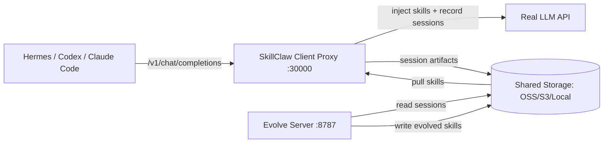

# SkillClaw 最新代码深度点评 · 2026年4月

> **仓库**: [AMAP-ML/SkillClaw](https://github.com/AMAP-ML/SkillClaw) · ⭐ 894 · 🍴 87 · 14 commits  
> **论文**: [arXiv:2604.08377](https://arxiv.org/abs/2604.08377) · HuggingFace #2 Paper of the Day · 283 upvotes  
> **时间线**: 4/10 开源 → 4/14 Hermes → 4/17 QwenPaw → 4/20 Codex+Claude Code → 4/22 Dashboard

---

## 一句话定位

**SkillClaw = Agent 的"技能进化中间件"**。它不做 Agent 本身，做的是一个 API 代理层 + 后台进化引擎，让 Hermes/Codex/Claude Code 这些 Agent 的 Skill 库从"写一次就烂在那儿"变成"用着用着自己变好"。

放在 2026 年 4 月的 Agent 格局来看，这个切入点非常精准——**所有人都在卷 Agent 框架本体，没人认真做 Skill 的生命周期管理**。

---

## 🔥 亮点：做对了什么

### 1. 架构设计一步到位：Proxy + Evolve Server 分离



> [!TIP]
> **Client Proxy 完全兼容 OpenAI `/v1/chat/completions` 和 Anthropic `/v1/messages`**，对 Agent 框架来说是零改造接入。这比 MCP 的侵入性低两个数量级。

这个设计的妙处在于：
- **Client Proxy 是即插即用的**——你根本不需要跑 Evolve Server 就已经有了 session 录制 + skill 注入
- **Storage 层是唯一的耦合点**——local / OSS / S3 三条路，一个人在 Mac 上跑 local 就能验证全流程
- 从一个人扩展到一个团队，只需要改 `sharing.*` 配置，不用换架构

### 2. 适配器层的工程硬功夫

`claw_adapter.py` 写了 **10 个 Agent 适配器**（openclaw, hermes, codex, claude, qwenpaw, ironclaw, picoclaw, zeroclaw, nanoclaw, nemoclaw），每个都做到了：

| 能力 | 实现 |
|------|------|
| 自动改配置 | 原子写入 + 改前自动备份 |
| 诊断命令 | `skillclaw doctor hermes` 逐项检查 |
| 一键回滚 | `skillclaw restore hermes` |
| 技能迁移 | 从 `~/.skillclaw/skills` 自动复制到 `~/.hermes/skills` |

> [!IMPORTANT]
> 尤其是 Codex 和 Claude Code 的适配器值得细看——Codex 走的是 TOML 文件手动解析（不依赖 `tomllib`），Claude Code 走 `settings.json` 里注入 `ANTHROPIC_BASE_URL`。两者都不依赖第三方库做配置修改，手写了完整的 TOML 表增删改查。**这是真正写过生产代码的人才会做的选择**。

### 3. Session → Skill 的追踪做得很细

`api_server.py` 里对 tool call 的追踪堪称全面：

```python
_READ_TOOL_NAMES = {"read", "file_read", "read_file", "readfile"}
_SKILL_WRITE_TOOL_NAMES = {"write", "file_write", "create_file", "edit", "patch", "apply_patch", ...}
_SHELL_TOOL_NAMES = {"shell", "exec", "bash", "terminal"}
_HERMES_SKILL_READ_TOOL_NAMES = {"skill_view"}
_HERMES_SKILL_WRITE_TOOL_NAMES = {"skill_manage"}
```

它能从 tool call 的参数里提取出哪些 `SKILL.md` 被修改了、是读还是写，甚至能处理 `apply_patch` 格式和 shell 命令里的路径。这种颗粒度的追踪让 Evolve Server 知道"这个 session 产出了什么 skill 变更"。

### 4. 12 天内铺了完整生态卡位

从 4/10 开源到 4/22：
- 4/10 → 初始开源
- 4/14 → Hermes 集成 + 微信群
- 4/17 → QwenPaw + Hermes 完整追踪
- 4/20 → **Codex + Claude Code**（两大当红炸子鸡一口气吃下）
- 4/22 → Dashboard 可视化

这个节奏说明团队很清楚：**Skill Evolution 本身没有护城河，先手覆盖主流 Agent 的集成才是壁垒**。

---

## ⚠️ 问题：没做好什么

### 1. Evolve Server 的"进化"到底怎么做的？—— 黑盒

Evolve Server 有两个引擎：
- `workflow`: 固定三阶段 LLM pipeline（Summarize → Aggregate → Execute）
- `agent`: 用 OpenClaw 开一个 workspace 来直接改 skill

但 **`evolve_server/pipeline/` 下的核心代码缺乏任何可观测性**。配置里有一堆旋钮（`evolve_strategy=dynamic_edit_conservative`, `use_session_judge`, `use_skill_verifier`, `reject_rewrite`），但：

> [!WARNING]
> - 没有文档说明每个 strategy 的行为差异
> - 没有 evolution 的 diff 记录让用户 review（`evolve_history.jsonl` 是有了，但没有 UI 展示）
> - Session Judge 判什么、Skill Verifier 打几分、阈值怎么定——全靠环境变量"盲调"

对于一个声称能"自动进化技能"的系统来说，**用户完全不知道进化发生了什么**，这是最大的信任问题。

### 2. Validation 机制只是个框架，实际落地存疑

```python
publish_mode: str = "direct"  # 或 "validated"
validation_required_results: int = 1
validation_required_approvals: int = 1
validation_min_mean_score: float = 0.75
```

设计上说可以让空闲的 Client 来验证候选 skill。但：
- **验证的标准是什么？** 用 LLM 打分？跑测试用例？
- `validation_required_results = 1` 默认只需要一个人通过——这跟没有验证有什么区别？
- 没有看到 skill 的 A/B testing 或 canary rollout 机制

在多用户场景下，一个坏 skill 一旦通过 validation 就会被同步到所有人。**这是群体进化系统的致命伤**。

### 3. Session 边界检测依赖"启发式"，Codex/Claude Code 没有显式 session header

代码里反复提到：

> "Codex/Claude Code session boundaries fall back to proxy-side heuristics because they do not send SkillClaw session headers."

所以 session 的切分是靠 **180 秒空闲超时**（`_SESSION_IDLE_CLOSE_SECONDS = 180`）。这意味着：
- 你开个会回来，session 就断了
- 你快速连续执行两个不相关任务，会被合并成一个 session
- Session 颗粒度直接影响 skill 质量——垃圾进，垃圾出

### 4. 安全模型过于朴素

- API Key 默认是 `"skillclaw"` 这个字符串
- Proxy 监听 `0.0.0.0:30000`（虽然默认 127.0.0.1，但配置可改）
- 所有 skill 内容明文存 OSS/S3
- 没有 skill 签名、没有来源追踪、没有 rollback 粒度控制

在团队模式下，一个人的"进化"可能会把另一个人的好 skill 覆盖掉。**没有 skill 版本控制的多用户系统 = 灾难**。

### 5. Dashboard 是后加的简易 Web，不是一等公民

Dashboard 用的是 **原生 JS + CSS**（占比 12.5% + 1.5%），看代码结构是一个 `skillclaw dashboard sync` 先拉数据到本地，然后 `skillclaw dashboard serve` 起个静态服务。

这说明它是一个"能看"但"不能操作"的仪表盘——**没有 approve/reject skill、没有 diff 对比、没有 timeline 回放**。对于需要人工介入的 evolution 流程来说，Dashboard 应该是控制面板，不只是观景台。

---

## 🌏 放在 2026 年 4 月 Agent 大势中看

| 维度 | 行业现状 | SkillClaw 的位置 |
|------|----------|-----------------|
| **Agent 框架** | Hermes 64k⭐ 一骑绝尘，Codex/Claude Code 三足鼎立 | 不做 Agent，做 Agent 的"技能后勤" |
| **Skill 体系** | 所有框架都在做 Skill，但都是各玩各的 | **唯一一个做跨框架 Skill 统一进化的** |
| **MCP 协议** | GitHub MCP Registry 上线，工具集成走向标准化 | 不走 MCP 路线，走 API Proxy 路线——更轻但更隐式 |
| **多 Agent 协同** | CrewAI、LangGraph 做 Agent 间协作 | 不做 Agent 间协作，做 Skill 间"交叉授粉" |
| **竞品** | SkillX、SkillNet、MetaClaw、SKILLFOUNDRY、Trace2Skill... | 论文并发密度惊人，但 **SkillClaw 是目前唯一有完整代码+多Agent适配的** |

> [!NOTE]
> **核心判断**：SkillClaw 在做的事情本质上是 **Agent 领域的 APT 包管理器 + 自动更新服务**。想法很好，方向很对，但距离真正 production-ready 还差关键一步——**信任链**。没有人会信任一个自己看不到 diff、没法 review、没有回滚的自动更新系统。

---

## 📋 给作者的直球建议

### 短期（值得立刻做）

1. **给 Evolve Server 加 diff 输出**——每次 skill 变更，生成标准 unified diff，写到 `evolve_history.jsonl` 里，Dashboard 上可查
2. **Session 边界要让 Agent 侧显式控制**——给 Hermes/Codex/Claude Code 提 PR 加 `X-SkillClaw-Session-Id` header
3. **Skill 版本控制**——每个 SKILL.md 加个 `version:` 字段 + `previous_hash:`，支持 rollback 到任意版本

### 中期（决定能不能落地）

4. **Skill 的 canary rollout**——先给 10% 用户用新 skill，观察效果，再全量发布
5. **Dashboard 从"看板"变"控制台"**——支持 approve / reject / revert / compare 操作
6. **加入 Skill 的来源追踪**——这条 skill 是从哪些 session 进化来的，哪些用户贡献了经验

### 远期（决定天花板）

7. **Skill 的 composition 和 dependency**——让 skill 可以引用其他 skill，形成 skill DAG
8. **考虑和 MCP 的融合**——把进化后的 skill 暴露为 MCP tool，让任何 Agent 都能用
9. **Skill 的自动退役**——长期没被引用的 skill 自动降级或归档

---

## 总评

> **SkillClaw 是 2026 年 4 月 Agent 赛道里最有"基础设施直觉"的项目**。它没有跟着卷 Agent 框架本身，而是卡住了一个所有 Agent 都需要但没人好好做的位置——Skill 的持续进化和跨用户共享。
>
> 但它的核心矛盾也在这里：**越是自动化的系统，用户越需要透明度和可控性**。目前的 Evolve Server 是一个黑盒，Dashboard 是一个哑巴。如果不解决信任问题，这个项目最终会沦为一个"论文仓库"而不是"生产工具"。
>
> **打分：7.5/10**——架构设计 9 分，工程质量 8 分，可观测性 5 分，安全模型 4 分，生态覆盖 9 分。
